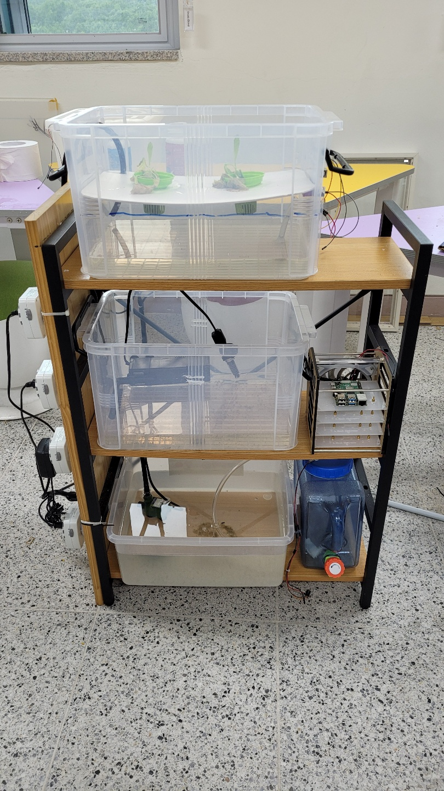

<h1> 프로젝트 결과 </h1> 

아쿠아 포닉스의 최종 디자인 모습입니다.

<h1> 프로젝트 추진 결과</h1>
-결과 분석
 
  
한번 저희가 만들어 보았는데 되는 부분들도 있었으나 문제들에 부딪히기도 했는데 그래도 전반적인 외형이 나오기도 하고 기술적인게 그래도 되었다는 점이 다행입니다.

 
-유지 보수
 
 
소프트웨어 쪽이나 하드웨어 쪽에 전반적인 것을 수정하고 안된 부분들을 수정을 하고 싶습니다. 그리고 외형 부분에서도 다른 부분에서도 분명 부족한 부분들을 매우거나 할 것입니다.

 

<h1> 결과 및 발표 자료</h1>

  
프로젝트 소개 영상/ 팀 소개 영상: https://youtu.be/qodatA5EYRM  /  https://youtu.be/IxkjiuZpPLc

 
  
계획 발표 자료 -중간 발표 자료 -최종 발표 자료는 https://drive.google.com/drive/folders/1XZNFnjG1ZnYgHPLXAWAqYbbQKX57QGVH?usp=sharing 여기서 보실 수 있습니다

 

<h1> 시연 영상 </h1>
  
https://drive.google.com/drive/folders/1nfDqDblYMp-HePtDRWvCP0g76Qm0frpw?usp=sharing 여기서 보실 수 있습니다.

  
  
 시연 영상 설명 

  
 하단 부에 있는 수중펌프에서 상단에 있는 식물이 자라는 공간으로 물을 끌어서 주고 

  
 일정량 이상 물이 채워질 경우 중간에 어항으로 물이 가고 마찬가지로 채워질 경우 내려가는 순환 시스템 입니다.

